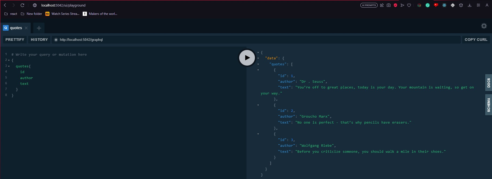

# Quote Of The Day
Building GraphQL APIs and Cliens using .Net

## GraphQL Playground
There is a nice UI embedded to this app using GraphQL Playground library.

The [link](http://localhost:5042/ui/playground) to access the UI from a browser.